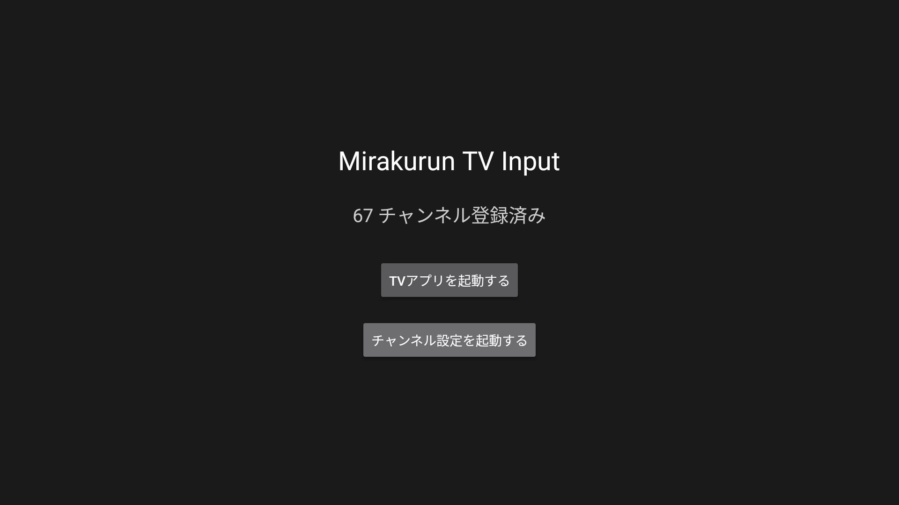
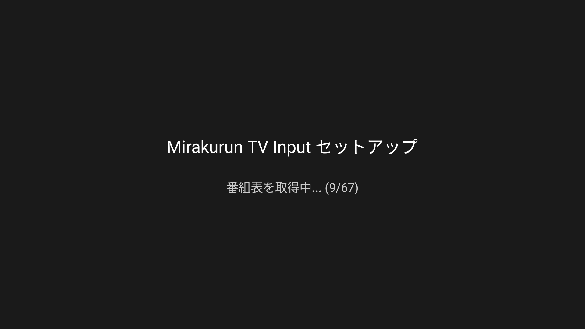

# Mirakurun TV Input

チューナーを内蔵しない Android TV 端末（チューナレステレビ、ドングル型 Android TV 機）で、家庭内ネットワーク上の [Mirakurun](https://github.com/Chinachu/Mirakurun) を通じて地デジ・BS・CS をライブ視聴するための TV Input Service です。

Android TV 標準の番組表やリモコン選局をそのまま使えるため、まるで内蔵チューナーのようにテレビを視聴できます。

## 主な機能

- **ライブ視聴** — Mirakurun のサービスをチャンネルとして登録し、Android TV 標準の番組表 UI からリモコンで選局・視聴
- **ARIB 字幕** — 日本の放送規格（ARIB STD-B24）に準拠した字幕をリアルタイム表示。プレイヤー UI の字幕 ON/OFF と連動
- **デュアルモノ音声** — バイリンガル放送の主音声・副音声を切り替え再生
- **番組表（EPG）** — Mirakurun の番組情報を取得し、Android TV の番組表に表示
- **MPEG-2 / H.264 両対応** — 地デジ（MPEG-2）・BS/CS（H.264）いずれも再生可能

## スクリーンショット

| メイン画面 | チャンネル設定 |
|:---:|:---:|
|  |  |

## TV Input Framework（TIF）とは

TV Input Framework（TIF）は、Android TV にテレビチューナー機能を統合するための仕組みです。TIF を使うことで、Android TV の標準 UI（番組表、チャンネルリスト、リモコン操作）をそのまま利用しながら、独自の映像ソースを「テレビチャンネル」として提供できます。

### TIF の全体像と本アプリの役割

```
┌─────────────────────────────────────────────────────┐
│                    Android TV                        │
│                                                     │
│  ┌──────────────────────┐   ┌────────────────────┐  │
│  │   TV アプリ (UI)      │   │  番組表・チャンネル  │  │
│  │  ・番組表の表示        │   │   データベース       │  │
│  │  ・チャンネル切り替え   │   │  (TvContract)      │  │
│  │  ・字幕 ON/OFF        │   └────────┬───────────┘  │
│  └──────────┬───────────┘            │              │
│             │ onTune / onSetCaption  │ query/insert │
│             ▼ Enabled / onSelectTrack▼              │
│  ┌──────────────────────────────────────────────┐   │
│  │        ★ Mirakurun TV Input ★                │   │
│  │        （本アプリが提供する部分）               │   │
│  │                                              │   │
│  │  ┌─────────────┐  ┌────────────────────────┐ │   │
│  │  │ チャンネル    │  │ セッション              │ │   │
│  │  │ 登録・EPG同期 │  │  ・選局 (onTune)       │ │   │
│  │  │              │  │  ・映像/音声再生        │ │   │
│  │  │              │  │  ・字幕オーバーレイ      │ │   │
│  │  │              │  │  ・音声トラック切替      │ │   │
│  │  └──────┬───────┘  └──────────┬─────────────┘ │   │
│  └─────────┼─────────────────────┼───────────────┘   │
│            │                     │                   │
└────────────┼─────────────────────┼───────────────────┘
             │ /api/services       │ /api/services/{id}/stream
             │ /api/programs       │ (生 MPEG-TS)
             ▼                     ▼
     ┌──────────────────────────────────┐
     │         Mirakurun                │
     │   (家庭内 LAN 上のサーバー)       │
     └──────────────────────────────────┘
```

TV アプリ（Sony Bravia の「テレビ」アプリや Google TV の Live Channels など）は OEM やプラットフォームが提供するもので、本アプリが提供するのは **TV Input Service** の部分です。チャンネル登録・番組表同期・選局・映像再生・字幕表示・音声切り替えのすべてを担います。

## 動作要件

- **Android TV 端末** — Android 8.0（API 26）以上
- **Mirakurun サーバー** — 同一 LAN 上で稼働していること（HTTP アクセス可能）
- **ネットワーク** — 端末と Mirakurun が同一ネットワーク上にあること

## 検証済み端末

| 端末 | OS | TV アプリ | 状態 |
|---|---|---|---|
| SONY ブラビア KJ-43X8000H | Android TV 10 | OEM「テレビ」アプリ | 動作確認済み |
| Google Streamer | Google TV（Android 14） | Live Channels | 動作確認済み |

## インストール

1. [Releases](../../releases) ページから最新の APK をダウンロード
2. Android TV 端末に APK をインストール（ADB 経由またはファイルマネージャー）
   ```
   adb install mirakurun-tvinput.apk
   ```

### ビルドする場合

Android Studio でプロジェクトを開いてビルドしてください。NDK（C++ ネイティブライブラリ）を使用するため、Android Studio の NDK と CMake のインストールが必要です。

## 設定方法

### 1. Mirakurun URL の設定

アプリを起動し、「チャンネル設定を起動する」ボタンを押します。Mirakurun の URL（例: `http://192.168.11.33:40772/`）を入力してください。

### 2. チャンネルの取得・登録

URL を設定後、「チャンネルを取得する」ボタンを押すと、Mirakurun からサービス一覧と番組表を取得してチャンネルとして登録します。

### 3. テレビの視聴

チャンネル登録が完了したら、メイン画面の「TVアプリを起動する」ボタンから TV アプリを起動し、番組表やチャンネルリストから選局して視聴できます。

## 制限事項

- **ワンセグ** — 非対応
- **4K（HEVC）** — 非対応
- **録画・タイムシフト再生** — 非対応
- **番組予約・録画機能の操作** — 非対応
- **Mirakurun 管理操作** — チャンネルスキャン以外は非対応

## 謝辞

本プロジェクトは、日本のデジタルテレビ放送に関わるオープンソースソフトウェアの成果に支えられています。

### [Mirakurun](https://github.com/Chinachu/Mirakurun)（kanreisa 氏）

本プロジェクトの土台となるデジタル放送チューナーサーバーソフトウェア。物理チューナーの制御と MPEG-TS ストリームの配信を HTTP API として提供することで、ネットワーク越しのテレビ視聴を可能にしています。Mirakurun なしには本プロジェクトは存在しません。

### [tsreadex](https://github.com/xtne6f/tsreadex)（xtne6f 氏）

MPEG-TS ストリームの前処理ライブラリ。本アプリでは NDK/JNI 経由で統合し、以下を実現しています:

- **PAT/PMT の正規化と PID 統一** — Mirakurun から届く生の MPEG-TS を ExoPlayer が安定して処理できる形に整形
- **デュアルモノ音声の分離** — バイリンガル放送で使われる ADTS `channel_configuration=0`（PCE + 2×SCE）という特殊な符号化を検出し、主音声と副音声を個別の PID に分離。これにより ExoPlayer で音声トラックの切り替えが可能に

### [libaribcaption](https://github.com/xqq/libaribcaption)（xqq 氏）

ARIB STD-B24 字幕のデコード・レンダリングライブラリ。本アプリでは NDK/JNI 経由で統合し、以下を実現しています:

- **ARIB 字幕のデコードとビットマップレンダリング** — 汎用の字幕エンジンでは対応できない日本の放送字幕規格を正確にデコードし、ビットマップ画像として描画。DRCS（外字）にも対応
- **Android TV 上でのリアルタイム字幕表示** — レンダリングされたビットマップを TIF のオーバーレイビューで映像に重ねて表示し、プレイヤー UI の字幕 ON/OFF と連動

これらのライブラリなしには、本プロジェクトの核心であるデュアルモノ音声と ARIB 字幕の実現は不可能でした。

## ライセンス

本プロジェクトのライセンスについては [LICENSE](LICENSE) を参照してください。

依存ライブラリのライセンス:
- tsreadex: MIT License
- libaribcaption: MIT License
