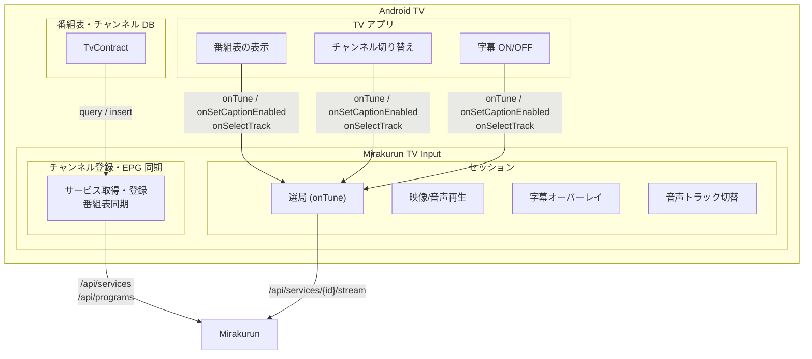

# Mirakurun TV Input

チューナーを内蔵しない Android TV 端末（チューナレステレビ、ドングル型 Android TV 機）で、LAN上の [Mirakurun](https://github.com/Chinachu/Mirakurun) を通じて放送をライブ視聴するための TV Input Service です。

Android TV 標準の番組表やリモコン選局をそのまま使えるため、まるで内蔵チューナーのようにテレビを視聴できます。

##え、◯◯でよくない？
### Mirakurun の　IPTV API と PVR Live 使ってTIFに入力すればよくない？
そう、自分もそう思ってたんです。でも字幕と副音声が出ないんです。日本独自の放送の仕様に合わせてプレイヤーのカスタマイズが必要たったんです。

### Codi とかIPTVアプリ使えばよくない？
いやほら、なんか、メーカー組み込みのテレビアプリに統合できるのってロマンあるじゃないですか。

## 主な機能

- **ライブ視聴** — Mirakurun のサービスをチャンネルとして登録し、Android TV 標準の番組表 UI からリモコンで選局・視聴
- **番組表（EPG）** — Mirakurun の番組情報を取得し、Android TV の番組表に表示
- **ARIB 字幕** — ARIB STD-B24に準拠した字幕をリアルタイム表示。Android TV 標準の字幕 ON/OFF  UI で切り替え。
- **デュアルモノ音声** — 主音声・副音声をAndroid TV 標準 UI で切り替え可

## スクリーンショット

| メイン画面 | チャンネル設定 |
|:---:|:---:|
|  |  |

## TIF : TV Input Frameworkとは

TV Input Framework は、Android TV にテレビチューナー機能を統合するための仕組みです。TIF を使うことで、Android TV の標準 UI（番組表、チャンネルリスト、リモコン操作）をそのまま利用しながら、独自の映像ソースを「テレビチャンネル」として提供できます。

### TIF の全体像と本アプリの役割

- TV アプリ：テレビ視聴のためのUI。例えば以下のようなアプリがあります。
  - TVメーカーがプリインストールするOEMアプリ。一般的に「テレビ」などと表示されます。
  - [Live Channels](https://play.google.com/store/apps/details?id=com.google.android.tv&hl=ja) : Google が提供するTVアプリのリファレンス実装。ストアから導入可能。最近のAndroid TVではインストールしてもアプリ一覧に表示されないことがあります。
  - [Mochi Live TV](https://play.google.com/store/apps/details?id=com.brunochanrio.mochitif.tv&hl=ja) : Live Channels から派生した機能強化版TVアプリ。ストアから導入可能。
- TV Input Service : TVアプリへのプレイヤー提供と番組表同期を担うバックグラウンドサービス。例えば以下のようなアプリがあります。
  - [PVR Live](https://play.google.com/store/apps/details?id=se.hedekonsult.pvrlive&hl=ja) : IPTV基準のm3uプレイリストやXML番組表URLを TV Input として登録できる。
  - Mirakurun TV Input : 本アプリ。

## 動作要件

- **Android TV 端末** — Android 8.0（API 26）以上。FireTVでは動作不可。
- **Mirakurun** — httpアクセスが可能であること。API URLのPath部分に変更がないこと。
- **ネットワーク** — TSを転送するのに十分なスループットがあること（20Mbps程度）

## 検証済み端末

| 端末 | OS | TV アプリ | 状態 |
|---|---|---|---|
| SONY ブラビア KJ-43X8000H | Android TV 10 | OEM「テレビ」アプリ | 動作確認済み |
| Google Streamer | Google TV（Android 14） | Live Channels / Mochi Live TV | 動作確認済み |

## インストール

- [Releases](../../releases) ページから最新の APK をダウンロードしてインストール
- Downloader by AFTVnewsをストアからインストール後、[Releases](../../releases) にある Code を使うと簡単にダウンロードできます。

### ビルドする場合

リポジトリをClone後 Android Studio でプロジェクトを開いてビルドできます。

## 設定方法

### 1. Mirakurun URL の設定

アプリを起動し、「チャンネル設定を起動する」ボタンを押します。TVアプリが存在しない場合は Live Channelsのストアページにリダイレクトされます。TVアプリの画面からMirakurun TV Inputを選び、Mirakurun の URL（例: `http://192.168.1.10:40772/`）を入力してください。

### 2. チャンネルの取得・登録

URL を設定後、「チャンネルを取得する」ボタンを押すと、Mirakurun からサービス一覧と番組表を取得してチャンネルとして登録します。

### 3. テレビの視聴

チャンネル登録が完了したら、TVアプリを起動して視聴することができます。TVアプリがアプリ一覧に表示されない場合、Mirakurun TV Inputのメイン画面の「TVアプリを起動する」ボタンから TV アプリを起動することができます。

## 制限事項

- **ワンセグ** — 非対応
- **4K（HEVC）** — 非対応
- **録画・タイムシフト再生** — 非対応
- **番組予約・録画機能の操作** — 非対応
- **Mirakurun 管理操作** — チャンネルスキャン以外は非対応

## 謝辞

本プロジェクトはDTVに関する各オープンソースソフトウェアの功績を利用しています。

### [Mirakurun](https://github.com/Chinachu/Mirakurun)

デジタルテレビチューナー API サーバー。

### [libaribcaption](https://github.com/xqq/libaribcaption)

ARIB STD-B24 字幕のデコード・レンダリングライブラリ。本アプリでは NDK/JNI 経由で統合し、以下を実現しています:

- **ARIB 字幕のデコードとビットマップレンダリング** — 汎用の字幕エンジンでは対応できない日本の放送字幕規格を正確にデコードし、ビットマップ画像として描画。DRCS（外字）にも対応
- **Android TV 上でのリアルタイム字幕表示** — レンダリングされたビットマップを TIF のオーバーレイビューで映像に重ねて表示し、プレイヤー UI の字幕 ON/OFF と連動

### [tsreadex](https://github.com/xtne6f/tsreadex)

MPEG-TS ストリームの前処理ライブラリ。本アプリでは NDK/JNI 経由で統合し、以下を実現しています:

- **PAT/PMT の正規化と PID 統一** — Mirakurun から届く生の MPEG-TS を ExoPlayer が安定して処理できる形に整形
- **デュアルモノ音声の分離** — バイリンガル放送で使われる ADTS `channel_configuration=0`（PCE + 2×SCE）という特殊な符号化を検出し、主音声と副音声を個別の PID に分離。これにより ExoPlayer で音声トラックの切り替えが可能に

